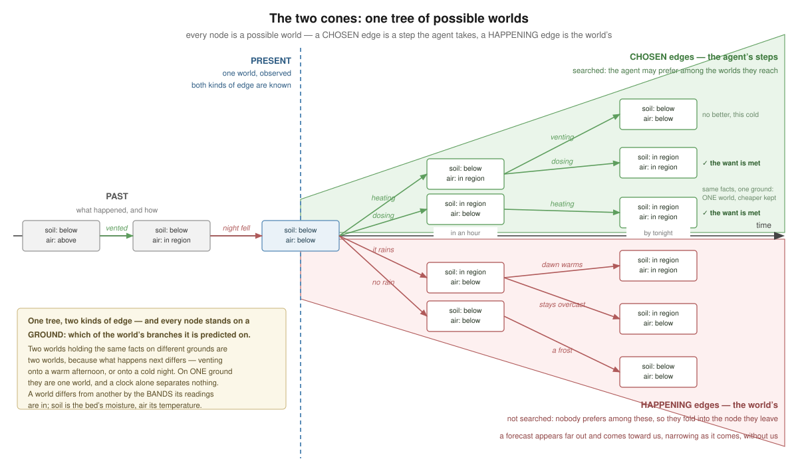

# The claim

**One tree of possible worlds, and two kinds of edge.** Every node of both cones is a
[possible world](/domain/imaginarium.md) at an instant, and that is the substance the two cones
share: a prediction is about possible worlds, and what an agent's actions do is move it among
them. What differs is not the nodes. It is WHO CHOOSES THE EDGE.

The picture labels every node with the [bands](/domain/band.md) its readings are in, and every
edge with what takes it: an action on a chosen one, a thing the world does on a happening one.
Two paths reach a world where the want is met, and on one ground that is one world — the search
keeps the cheaper path and discards the other as somewhere already reached. What would make
them two is a second ground, which is item 1 below.

- **A CHOSEN edge is a step.** The agent takes it, so the world it leads to is one the agent may
  prefer among. This is the tree
  [the-future-is-a-cone-and-the-present-is-identified-in-it](/decisions/the-future-is-a-cone-and-the-present-is-identified-in-it.md)
  already describes and #553 already built.
- **A HAPPENING edge is the world's.** Readings not yet taken: what the soil will show, whether
  it rains, whether the sun has set by the time a vent opens. Nobody prefers among these, so
  there is nothing on them to search.

**So a possible world is the present, plus what the world moved, plus what the agent moved** —
the sovereign's equation, and it is exact in the arithmetic already here. A node is held as its
net diff against the observed present, `(base − D−) + D+`, advanced by set algebra a step at a
time; a happening edge advances it by the same algebra, since a prediction is a claim about
facts like any other. What changes is only WHO AUTHORED the movement, which is why the two
summands must stay apart: the facts are their sum, and a world where the soil is in the region
because it rained holds the same facts as one where it is in the region because the agent
dosed.

**The identity keeps the branch, not its total.** Two grounds that have moved the world the same
distance so far need not move it the same way next — *it rained and stopped* and *it is still
raining* agree about the soil and disagree about the hour to come — so a node carries which
happening edges it stands under rather than their net. That is the one place the arithmetic does
not suffice, and the reason is the same one the whole record turns on: a happening edge is a
claim about what the world will keep doing, and the sum forgets it.

**A peer is the world, from here.** Nothing another agent does is on this agent's menu, so its
acts move the world regardless of what this one chooses: they arrive as happening edges, not as
steps. That is [model-it-only-if-a-plan-would-branch-on-it](/decisions/model-it-only-if-a-plan-would-branch-on-it.md)'s
first-order rule read forward — what a peer DID is a fact, what a peer WILL do is a prediction —
and it says where a society's mutual expectations will hang when anyone builds them.

**The modality belongs to the EDGE, not to the node.** A chosen edge is intention-shaped — it is
something to commit to; a happening one is belief-shaped — it is something to be right or wrong
about. That is why the two cannot be scored alike: ranking is meaningful over what an agent
chooses, and there is no preferring one weather to another. Folding the happening edges into the
node they leave rather than expanding them as candidates is therefore the semantics rather than
an optimisation.

Two things follow for whoever builds it. **One structure and not two** — the imaginarium already
holds this tree, and what item 3 below adds is a second kind of edge in it rather than a second
store. And the second kind is not a new idea here: `SURPRISE_EXOGENOUS` in the planner already
names a happening edge the search never drew, which is exactly what an exogenous surprise IS.

**Execution walks one kind of edge and settles the other.** Acting takes a chosen edge.
Observing settles which happening edge was taken while it was. The present is where both are
known, which is why [identification](/domain/identification.md) is doing two jobs at once:
deciding which path the agent is on, and which of the world's branches the real one landed in.

# What it explains that we had been working around

**A look changes no fact.** Its predicted world nets to nothing against its parent, so the
search discards it as somewhere already reached. Every attempt to make the planner value
looking has run into this, and the current answer is a special case: a step that MEETS a want is
not expanded from, so a look survives by not being a place to search onward from
(a-lever-an-agent-cannot-pull-is-not-a-lever).

Under this model the reason is plain and the workaround is unnecessary. A look takes a chosen
edge to a possible world holding the same facts — which is why its diff is empty — and FEWER
happening edges leaving it. It acts on the branching rather than on the world. The search cannot
see that because the search has no branching to see, and the fix is not a rule about looks. It
is the second kind of edge.

Sensing has said the sentence for a long time: *looking changes what you KNOW, not what is*.
What was missing was a place for it to have consequences.

# What follows, in the order it would be built

1. **A node is GROUNDED on a prediction**, and identity becomes world-and-ground
   ([#587](https://github.com/ShishkinDmitriy/orexis/issues/587), landed). A node's ground is which of the world's own branches it sits
   under — the happening edges taken to reach it, where a step is a chosen one. Two worlds
   holding the same facts on different grounds are two worlds, because what happens next
   differs: a bed vented onto a warm afternoon is not the same world as the same bed vented
   onto a cold night, and neither its facts nor a clock separates them.

   Built as `signature.where`, the node's diff and its ground, with a step inheriting its
   parent's — taking a lever never changes which branch of the world you are in. Every pass has
   ONE ground today, the present, observed, because nothing here predicts; so the pair is the
   diff it always was, and every shipped world plans exactly as before. That is not a mechanism
   idling: it is the shape the ground fills the day item 3 draws a happening edge, and what it
   replaced had to be measured to be refused.

   **It was a node's TIME for a day, and the measurement refused it.** Keying on the path's
   summed `orexis:landsAfter` changed nothing on any shipped world, and where a landing was
   declared it cost cycle detection its grip — hanoi with a minute per move went from 50 forks
   to a whole 128-world budget on three disks and stopped solving at that world's own 64 — and
   cost a shipped answer besides: a market host owing water it does not hold planned a serve
   from a barrel too low instead of the refill, because a dry serve predicts nothing and a world
   that predicts nothing had stopped colliding with the world it was predicted from. What makes
   a later world a different world is not that it is later. It is that something the world does
   has happened in between, which is a prediction. So no grain has to be guessed: a pass with
   one ground is timeless by construction, and time reaches identity through the ground when a
   forecast says what the world does between two instants. See
   [a-plan-is-a-path-of-graph-diffs](/decisions/a-plan-is-a-path-of-graph-diffs.md).

   **The drift is [#592](https://github.com/ShishkinDmitriy/orexis/issues/592)**, and it is a happening edge like any other: an imagined
   reading has no number to move, since an effect declares the band it reaches and no value, so
   a drift is the statement that a reading in one band becomes a reading in another after long
   enough — the declaration item 3 exists for, on the clock item 2 hands a rule.
2. **A rule may read the clock its step lands at** ([#588](https://github.com/ShishkinDmitriy/orexis/issues/588), landed). The search already summed each
   step's `orexis:landsAfter` and never handed the number over. It does now: `$lands`, the
   node's own instant — the pass's clock, read once at the root, plus the path's landings —
   plus what this act's own timing adds, asked BEFORE the effect is run rather than after.

   Its first consumer is every shipped construct: a reading a rule predicts exists when the act
   completes, so it is stamped then instead of at the moment the plan was made. That also
   found what #579 had left behind — the search cannot size an act, so a dose's `ml / rate`
   lands at nought seconds and only a bid's window survives as a real landing — and the
   sovereign's answer to it is that an act was never a point:
   [#596](https://github.com/ShishkinDmitriy/orexis/issues/596) gives an action a DURATION and a possible world the INTERVAL it holds
   over, each stated as a range where it is not known exactly. What a rule is told is then an
   interval, and this token is the place it arrives.

   **One instant, not two.** A rule's WHERE describes the conditions its act is TAKEN in, and
   its construct the world the act REACHES; the market proves they cannot be one token, since a
   bid's premise is that the round is still open and a bid lands the window plus the pour after
   it is placed. So a WHERE still asks `NOW()`, and the instant an act is taken at is a seam
   this leaves open.

   It does NOT close the vent's seam, and that is the honest half: a rule can now ask what time
   its act happens at, and has nothing to read about what the outside will be then, because
   nothing states a future reading. That is item 3 ([effect](/domain/effect.md)).
3. **Exogenous uncertainty is a narrowing set of [bands](/domain/band.md)** ([#589](https://github.com/ShishkinDmitriy/orexis/issues/589)), and it is where
   [a-graph-says-what-it-speaks-for](/decisions/a-graph-says-what-it-speaks-for.md) is
   built first: a forecast is facts valid over a FUTURE interval, which is the one horizon in
   this project with no mechanism at all, and a graph that says how long it speaks for is the
   cheapest place to put it. Three days out a
   reading may be any band, tonight two, now exactly one. A forecast is an observation whose
   `sosa:phenomenonTime` is in the future, arriving `orexis:Received` from a service rather than
   an instrument, in a per-agent graph of its own — never the sensed graph, which upserts one
   reading per subject and property and means *now*.
4. **A look is a chosen edge that narrows the happening ones**
   ([#590](https://github.com/ShishkinDmitriy/orexis/issues/590)), valued by the narrowing it buys rather than by a
   fact it makes true. This is what makes *dose, look, dose* findable by a search rather than by
   re-planning after a surprise, and it retires the special case above.
5. **Long-lived and overlapping actions** ([#591](https://github.com/ShishkinDmitriy/orexis/issues/591)), the largest and last. If a step spans an
   interval rather than landing at a point, a plan stops being a sequence and becomes a partial
   order: dosing while the heater runs. `progression:then`, the ledger and the keeper's advance
   all assume a chain. Its foundation is [#596](https://github.com/ShishkinDmitriy/orexis/issues/596) — an act with a DURATION rather than a
   landing alone, and a world holding over the interval two acts would overlap IN. The
   vocabulary already knows they are two things: `orexis:landsAfter` is delivery, when the
   valve stops, and it says in its own comment that settling is a term nobody has written down.

# What was refused

- **Searching the world's branches.** Expanding "it rains" and "it does not" as candidates puts
  the weather on the menu, and a menu is what an agent may DO. The branches are folded into the
  node they belong to, which is also what keeps the fork count from multiplying by the forecast.
- **Ranking them by expected value.** Probability would need a semantics for scoring a world by
  what it is worth times how likely it is, which changes how every world is ranked and what a
  plan even means. A narrowing set of bands says the same thing coarsely, in the domain's own
  words, and the keeper's verdict already catches a branch that did not happen. The cheaper
  mechanism is the one this project keeps choosing: the world verifies a plan, a search does
  not prove it.
- **A timeless node.** It is what we have, and it is why a plan can be simulated against a world
  six hours out of date and no gate says so. The cost of fixing it is real and named in item 1;
  the cost of not fixing it is a search that plans against a world that has stopped existing.
- **A rule about looks.** The special case works and is small, and it would go on working. It is
  refused because it explains nothing: it keeps a look alive without letting the search say why
  a look is worth taking, which is the question every *dose, look, dose* plan turns on.

# Seams left open

- **Whose forecast, and how trusted.** A reading is an instrument's word and the only arrival
  whose trustworthiness is a question; a forecast is a service's, further out and less
  answerable. It needs a horizon like any reading — past it, it is not evidence — and the
  freshness machinery is the natural place, applied to a fact about the future.
- **An agent talked out of acting by weather that never comes.** The verdict catches it and the
  next pass replans, so the cost is a delay rather than an error. Whether a want should refuse
  to wait past some point is a policy nobody has needed yet.
- **Two agents' belief cones.** Nothing here says what happens when what I will believe depends
  on what you will do. Beliefs about other agents stay first-order — what they DID, never what
  they believe — and this record does not move that line.
