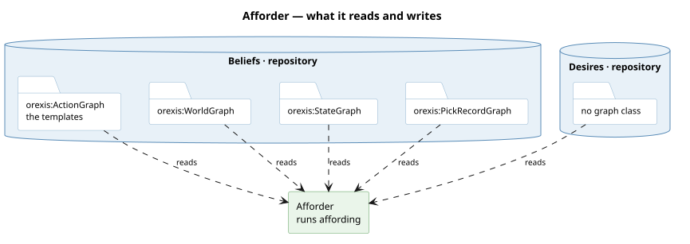

# What it is

An **affordance** is one row of the answer to *what could I do?* — asked of the graph, never
written into it:

| | |
|---|---|
| `action` | the [action](/domain/action.md) — the kind of act: `sensing:Observing`, `actuation:Dosing`, `market:Acquiring`, `market:Offering` |
| `want` | the [desire](/domain/desire.md) it serves — the node, which is the kernel's only key. Empty on a row that serves any want (a host's Offering); on a row owed to someone, the want about the debt it serves |
| `about` | what that want is about — `orexis:about`, said by whoever derived the want and opaque to the kernel: a property for a stake, an instrument for a freshness want. Carried to the effect as `$about` |
| `via` | the lever it goes through: this probe, this valve, this venue |
| `direction` | which way it moves the property, or **empty** for a look |
| `for_agent` | whom the row serves, where it is an obligation's — read off the debt the named want is about. Absent on the agent's own rows |

`Afforder.offered` hands back every such row for one agent, in one world. For the
simulation's fern: *look at moisture through the probe; look at temperature through the
thermometer; raise moisture through the market.* For the loner world's gardener: *raise it
through your own pump* — the Actuate rung, offered exactly where the lever chain and the
resource chain both end at the agent.

**A row's emptiness is data.** Looking moves nothing, so Observe's `direction` column is blank,
and a model reading the menu learns from that blank which moves change the world and which only
change what it knows.

# It is derived, and that is not a performance choice

A row is a **conclusion whose premises are stored** — regions, wiring, denominations, all facts
that exist for their own reasons. Storing the conclusion would let it outlive them: unplumb the
valve and an authored row still says you can dose. So they are computed on every ask, and the
[menu graph](/decisions/the-mind-is-six-graphs.md) holds rules about means but never rows about
levers.

The same argument in reverse is why the [action](/domain/action.md) *is* stored — a node in
`actions.ttl` is a schema, and a schema cannot outlive anything.

# Which world, is the caller's to say

**The world a row is true in is a PARAMETER, and that is the whole of why nothing is stored.**
`Affordances` is handed a door — `beliefs.query_at` for what is, the
[imaginarium](/domain/imaginarium.md)'s for a world a plan is imagining — so stock after a refill
appears among that world's rows and not among this one's. A stored answer has one world; a search
needs one per node.

Every token a precondition carries is filled by `store.bind` (#500): a whole token, rendered as
the term the value is, and a text still carrying a token nobody bound refuses rather than
reaching the engine as a free variable — where the engine's own parameters serve only the
kernel's simple queries, since they cannot reach a subquery or an aggregate.

**Neither this collection nor [actions](/domain/action.md) is the [menu](/domain/menu.md).** The
menu is the MODALITY both sit in — *what I could do* — and the word had been naming all three.
`Actions` keeps what the packages declare; this derives what one of them comes to in one world,
one action at a time; deciding which to ask about and whose wants to ask them against is
neither's but the [afforder](/domain/afforder.md)'s. A modality, a thing that keeps, a thing that
derives and a thing that decides are four kinds, and one name for all of them hid which was meant
in any given sentence.

# An affordance is the precondition language

This is the part worth internalising, because it is why planning needs no `requires` clause of
its own.

**A row whose premises cannot hold does not exist.** Sensing's walk is `polls → monitors →
observes`; the market's closes venue → source → good → valuation. Every hop must hold or there
is no row. So "is this act available?" and "does this row exist?" are the same question — and
**chaining is the same query re-run in the simulated world**: an effect that makes a missing row
appear is the step before it.

`packages/orexis-agent-deliberation/planner.py` therefore consults no declaration of what a lever
repairs. Simulation is the authority either way: trying a lever that turns out not to help costs
one validation; trusting a declaration that turns out to be wrong costs a plant.

# Each package ships its own rows

There is no menu file. Each package that owns a lever ships its [actions](/domain/action.md),
and `Afforder.offered` runs every action's `orexis:available` it finds in the store — sensing contributes
Observe, actuation Actuate, the market Acquire and the host's Apply.

It began as one `menu.rq` in the deliberation package, which made the KINDS of action a registry in
one directory: adding a way of acting meant editing another package's file. The sovereign caught
the overclaim — *how is it dynamic if the list is hardcoded?* — and the fix was this repo's
mechanic applied again. **A new way of acting is a new directory**: an action node for its
schema, availability and effect, and a `take()` on the module the node names.

`$me` is the one thing a shipped query cannot know, and it is substituted by whoever collects the
menu. Everything else is an unqualified pattern, because regions and wiring are public.

# Whom a row serves

A row of the agent's **own** is an option a deliberator ranges over. A row that names
`for_agent` is a **obligation's**: a lever the agent must exercise on a valid presentation and must
never *propose* for a gap of its own. A host holding a claim owes the dose; nothing about that
is a decision, and a deliberator that ranged over it would be choosing whether to keep its word.

That one column is the whole of the distinction — there is no mode term
([an-action-is-one-node](/decisions/an-action-is-one-node.md)). It is also what lets an obligation find
its means: the row that answers is the one the market joined to the want about that debt, and
it carries whom the debt is owed to.

# The row that is not there

A want with no row is a real answer and a legible one. Fern holds a desire in air temperature
and can see it, but nothing it owns or can buy moves it: three Observe rows, no lever. That is a
**want with no means** — legitimate, not a misconfiguration — and the search reports it as
`no candidate` rather than as failure. It is the difference between *equip me* and *my doses are
too coarse*, which is a distinction a planner that reported them alike would destroy.

# Related

- [action](/domain/action.md) is the node a row is one instance of — its availability query, run now.
- [deliberation](/domain/deliberator.md) ranges over the agent's own rows, scores them by simulation,
  and holds what a lever DOES — a row says only that one is available.
- [desire](/domain/desire.md) is the other half of a decision: a row answers *what could I do*, a
  gap answers *about what*.
- [actor](/domain/actor.md) is the code a row is linked to: the module that contributes the row's action.
- [package](/domain/package.md) is how a contribution is found: a directory, and nothing lists it.
- [the-mind-is-six-graphs](/decisions/the-mind-is-six-graphs.md) places rows in the menu modality
  and explains why they are derived where a rule is asserted.
