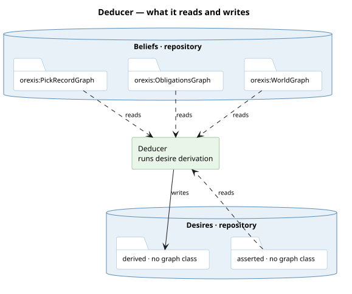

# What it runs

**Root derivation, at genesis.** Collect each package's `desires.ru`, substitute the graphs they
write into — `$derived` is the agent's roots graph — and run them at birth: a root per premise
that binds, with its met-tests, authored once and holding at every instant. At every later boot
the same rules run into a scratch and only a root the volume has never held is copied in: an
amendment endows, a held root stays whatever the world now says, and removal is a rebirth
([a-root-holds-always-and-an-outdated-graph-is-dropped](/decisions/a-root-holds-always-and-an-outdated-graph-is-dropped.md)).
Nothing of the agent's state enters a root — no foresight, no aim in the label — because a pick
is the agent's and a root is not a function of it; pursuit asks the choir how far a root
foresees when it derives a child.

**The repository's build is a projection.** `Projection` in `desire.py` copies the roots graph and
the records — picks, obligations, promises, pursued children — and runs no rule. It was the
Deducer until a root was seen to be re-derived from a pick on every rebuild.

# What it reads and writes

# The one unclean seam

The projection is a class inside `packages/orexis-agent-deliberation/desire.py`, extending the store the
[desires repository](/decisions/a-store-is-a-modality.md) wraps; the derivation itself is
`author_roots` in `agent/genesis.py`, beside birth and endowment. The rule it protects is real —
nothing the runtime holds can write a want, so an agent cannot satisfy itself by attrition — but
it is kept true by hiding the writer inside rather than by the layering everything else follows.

**The roots graph has a class** — `orexis:DesireGraph`, per agent, holding at every instant — since
#644; the asserted wants stay the world's public graph.
