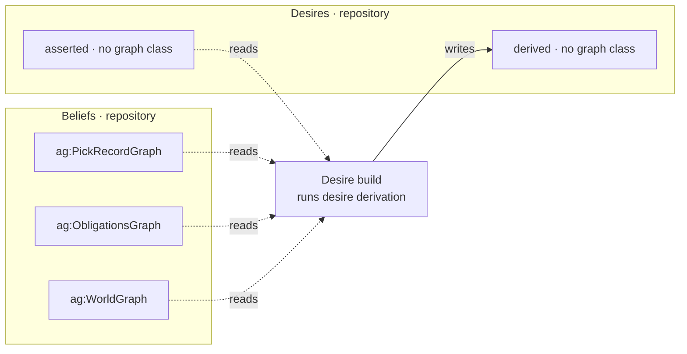

# What it runs

**Desire derivation.** Collect each package's `desires.ru`, substitute the graphs they write into,
and run them: a want per premise that binds. Re-run at every boot and every rebuild, so a want
whose premise has ceased is no longer implied rather than retracted by anyone.

# What it reads and writes

# The one unclean seam

This service is a class inside `agent/desire.py`, extending the store the
[desires repository](/decisions/a-store-is-a-modality.md) wraps. The rule it protects is real —
nothing the runtime holds can write a want, so an agent cannot satisfy itself by attrition — but
it is kept true by hiding the writer inside rather than by the layering everything else follows.

**And the two graphs have no class.** Retired when the modality became a store, which means this
is the one service whose outputs cannot be drawn by type at all.
