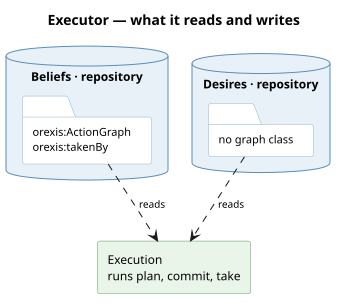

# What it runs

**Execution** — plan, commit the head, hand it to its actor. One road, whatever the trigger,
in two files since the kernel split along its layers
([a-layer-is-a-package-and-need-loads-it](/decisions/a-layer-is-a-package-and-need-loads-it.md)):
`packages/orexis-agent-deliberation/pursuit.py` holds `pursue` and `pursue_for` — the search
and the commit — and `packages/orexis-agent-progression/execution.py` holds `carry_out`,
`take_standing` and `taken_by`, the road from a committed act to its actor. The cut is at the
one line where deciding stops and doing starts, which is also where the search's thread
stops and the reactive loop begins: only a plan's HEAD crosses, committed and taken as one
item on the executing thread.

# Phases

1. **Plan.** `deliberator.decide(desire)` — the search, unchanged, returning its
   [plan](/domain/deliberator.md) as rows. No steps means nothing to execute, and that None is
   the deliberator's decision, not this process's.
2. **Commit.** The head [step](/domain/step.md)'s [act](/domain/act.md) goes to the keeper:
   `adopt(action, want, because, via=lever)`.
   The [intention](/domain/intention.md) written carries the lever the plan chose. If one
   already stands within patience, `adopt` returns None and the process ends here — the same
   impulse, absorbed, and no row written. That is the whole of the patience, because every
   means stands until the world answers
   ([an-intention-stands-until-the-world-answers](/decisions/an-intention-stands-until-the-world-answers.md)).
3. **Take.** The means' `ag:takenBy` family is asked of the T-Box, `agent.providers(family)` of
   the runtime, and each [actor](/domain/actor.md) is handed the act. At least one True is the
   step taken; all False is logged and the intention stands for the next trigger.

Two doors, and both are the same three phases: `pursue(agent, desire)` for a want in hand, and
`pursue_for(agent, want)` for an actor holding a fresh reading — which want a reading is about
is [sensing](/domain/sensing.md)'s to say (`want_about`: an unmet epistemic want first, then the
stake), so the actor hands the kernel a NODE and goes through the desire door. The kernel keys
nothing by property ([the-stake-is-sensings-want](/decisions/the-stake-is-sensings-want.md)).

# What it reads and writes

**It writes no graph of its own**, which is the shape of a service that only orchestrates: the
keeper writes the ledger, the actor does the thing, and the link from a row to its code is one
triple nobody here names.

# What starts it

| trigger | who | what it used to do instead |
|---|---|---|
| the patience tick | deliberator, marking; the reviser's worker pursues | plan every want, carry out Observe alone |
| a reading recorded | actuation | ask the deliberator, adopt, dose — its own copy of all three |
| an offer, reading in hand | bidding | ask the deliberator inside `submit`, adopt, bid |
| a claim presented, or stock arriving with one held | hosting | ask the deliberator, serve if it said Apply |

**A standing step is executed, not re-decided.** The bidder's case is the one that mattered: a
round is decided once — by the offer or by the tick while it is open, whichever comes first —
and the other finds the `Acquire` standing and searches nothing. A round used to cost three
passes over one world; it costs one. Between rounds nothing stands to buy, because the row does
not exist ([a-round-is-a-fact-and-offering-is-an-action](/decisions/a-round-is-a-fact-and-offering-is-an-action.md)).

# What it is not

- **Not a planner.** It holds no imaginarium, scores nothing, and never sees a candidate the
  search rejected.
- **Not a second keeper.** It calls `adopt` and never writes the ledger; the one-writer scan in
  `tests/test_intention.py` still holds.
- **Not the tail.** Only the head is committed, because the plan is re-derived every pass and the
  world moves between them — the argument is
  [an-intention-is-a-plan-committed-to](/decisions/an-intention-is-a-plan-committed-to.md)'s.
