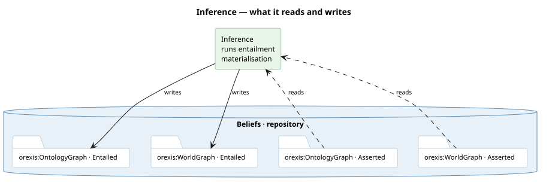

# What it runs

**Entailment materialisation**, at genesis and before any derivation rule. Twenty-five declared
axioms become asserted triples: subclass and subproperty closure over the vocabulary, then the
same over the instances a world states.

# What it reads and writes

**A type does not distinguish these, and the arrival does.** `graph/ontology` and
`graph/ontology/entailed` are both `ag:OntologyGraph`; what separates them is `ag:arrivedBy`. So
a diagram that names graphs by type must carry arrival beside it wherever a service writes back
into the type it read.

# Why it runs first

Order is the point: a derivation rule may then ask what a thing IS rather than spelling out a
subclass path, because by the time it runs the answer is asserted. Widening belongs here rather
than in a query — `tests/test_inference.py` refuses a seventh hand-rolled walk.
