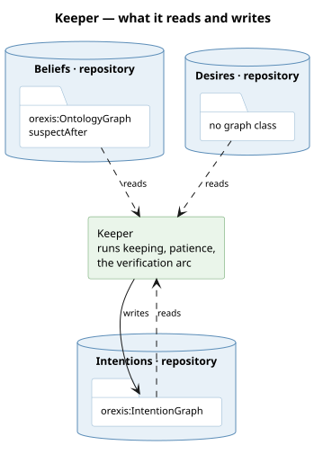

# What it runs

Three jobs that share one graph. **The clock it held is gone from here** — the patience tick
that handed every want to execution moved to the [deliberator](/domain/deliberator.md) when the
kernel split along its layers (#452): progression may not import the search above it, and a
tick whose whole job is to ask the search belongs to the layer that searches. The PATIENCE
stays: it is still `progression:patienceS`, handed in by the container at construction — progression
reads no belief — and the deliberator ticks at it.

- **Keeping.** `adopt` / `satisfy` / `drop`, each row carrying when it was adopted, how it
  resolved, and why in both directions.
- **The patience.** Within `progression:patienceS` a second impulse toward the same commitment is
  absorbed rather than re-decided — the amortisation that makes an expensive deliberator
  affordable.
- **The verification arc.** `expect` opens an expectation with a baseline and a deadline; the
  predictor's comparison at a reading's arrival, or the deadline, closes it (#639); enough unmet
  verdicts for one pair raise a suspicion.

# What it reads and writes

**The sole writer, and that is structural.** No other service touches the intention graph; a
one-writer scan in `tests/test_intention.py` holds it.

# What it is not

Nothing here chooses. [Execution](/domain/executor.md) hands it a plan's head; the *whether*
belongs to [deliberation](/domain/deliberator.md). And what a commitment IS — the lifecycle, the
expectation, why absorption is a cost model — is [intention](/domain/intention.md)'s to say. This
page is the service: its three jobs and the one graph it may write.

# In Agent 0.2.0

There is no keeper. The intentions it kept, the patience it owned and the taking the 0.1.0 executor
did are one service there, the [executor](/domain/executor.md), and this page describes the
progression layer's keeper alone.

