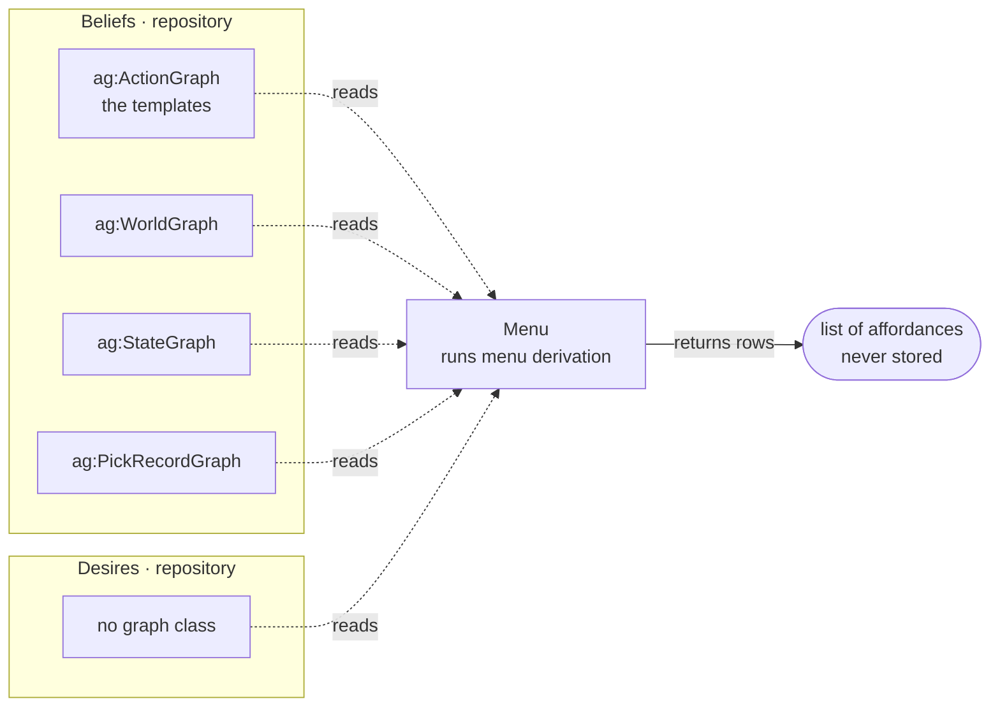

# What it runs

**Menu derivation.** For every `ag:Action` in the action graph, run its `ag:available` query with
`$me`, `$wants`, `$beliefs` and `$state` filled in, and collect the
[affordance](/domain/affordance.md) rows it binds. Sorted, returned, and written nowhere.

# What it reads and writes

**`$state` is a parameter, and that is the whole reason nothing is stored.** The planner binds it
to a node of the [imaginarium](/domain/imaginarium.md), so stock after a refill appears in that
world's menu and not in this one's. A stored menu has one state; a search needs one per node.

# Why the modality has no repository

The menu is one of the six modalities, and `ag:MenuGraph` is a real class — but its only instance
is the action graph, which holds templates rather than rows. A row exists exactly while its
premise holds, so storing one would mean keeping a conclusion that its own plumbing can outlive.
