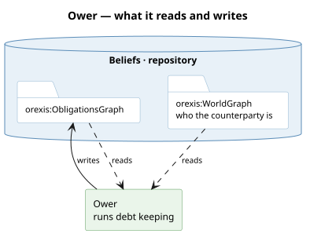

# What it runs

**Debt keeping.** `owe` raises a row when a claim is issued; `demanded` marks it presented;
`discharge` closes it. Each row is an [obligation](/domain/obligation.md) — a want this agent did
not source — so a debt is pursued through the same road as anything else it wants.

# What it reads and writes

**Durable on purpose.** A host's in-memory record of what it issued dies with the process; the
ledger is what survives a restart, which is why a claim raises a row whether or not the holder
ever presents it.

# What it is not

**It is [hosting](/domain/market.md)'s, and the modality is the kernel's.** Only a host owes,
because a debt arises from a claim this agent ISSUED — so the ledger lives in the market package
and `HostingModule` holds it. What stays the mind's is the
[obligation](/domain/obligation.md) itself: the class, the graph it is written into, and the
branches that rank a debt beside a want.

**Which needed no new mechanism**, and that is the point worth keeping. A package writing a graph
the kernel declares is what [sensing](/domain/sensing.md) already does with `graph/sensed` — so
the ledger writes `ag:ObligationsGraph` exactly as sensing writes the state graph, and nothing in
the kernel learns that market exists.

**Not a capability of its own.** Keeping a record cannot be done two ways, and rule 2 reserves a
capability for an ability whose *how* could differ. It is a thing hosting holds, and what it
contributes to the choir — the debts among what this agent pursues, and the figures beneath
them — arrives through the module that holds it.
