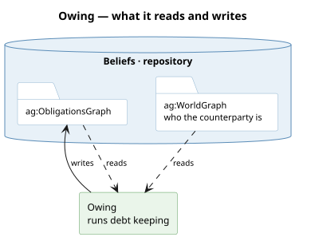

# What it runs

**Debt keeping.** `owe` raises a row when a claim is issued; `demanded` marks it presented;
`discharge` closes it. Each row is an [obligation](/domain/obligation.md) — a want this agent did
not source — so a debt is pursued through the same road as anything else it wants.

# What it reads and writes

**Durable on purpose.** A host's in-memory record of what it issued dies with the process; the
ledger is what survives a restart, which is why a claim raises a row whether or not the holder
ever presents it.

# What it is not

**Not the market's.** The venue decides who owes what; this records that it happened. An agent
with no stake of its own still keeps this ledger, which is why it is the kernel's and not a
grant.
