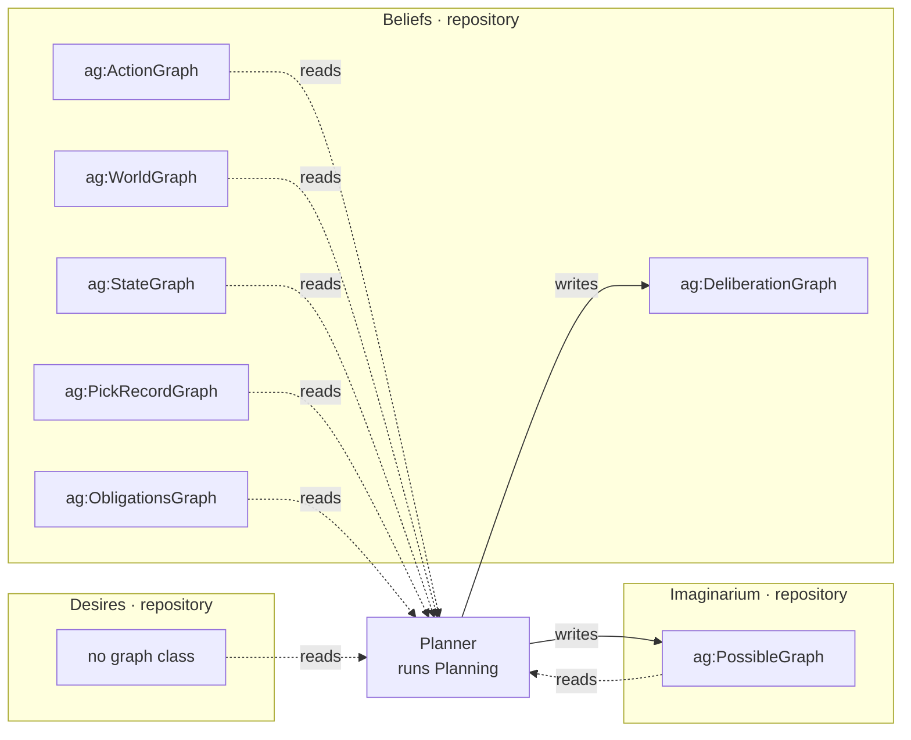

# What it runs

**Planning.** Given one [desire](/domain/desire.md), walk the [affordance](/domain/affordance.md)
rows the [menu](/domain/menu.md) yields, simulate each by applying its
[effect](/domain/effect.md) to the world reached so far, and rank the results by urgency. Bounded
depth, breadth-first, so siblings are alive at once — which is why a world is a value rather
than a mutable state.

# What it reads and writes

**One service, one output modality.** `ag:DeliberationGraph` is a subclass of
`ag:PossibleGraph`, so both writes are possible-modality: the worlds that die with the pass, and
the trace that survives because the health series read it.

# What it is not

**Not the decider.** [Deliberation](/domain/deliberation.md) chooses whether to pursue at all and
calls this; [execution](/domain/execution.md) commits the head. The plan itself is returned and
never stored — it is [required to be lost](/decisions/there-is-no-bdi-ontology.md).
