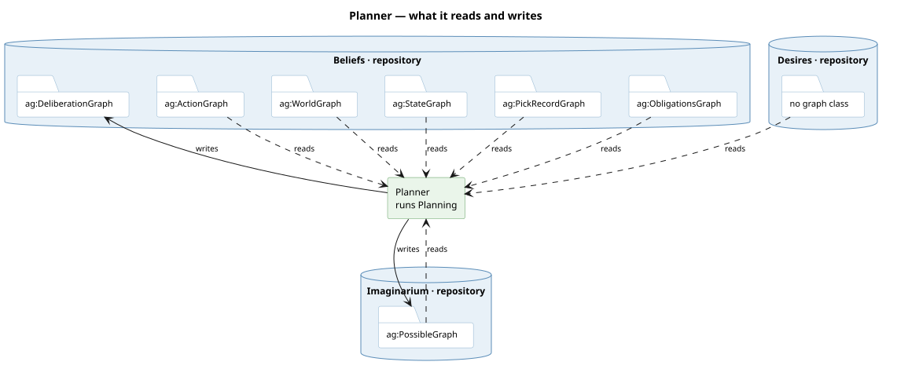

# What it runs

**Planning.** Given one [desire](/domain/desire.md), walk the [affordance](/domain/affordance.md)
rows the [afforder](/domain/afforder.md) yields, simulate each by applying its
[effect](/domain/effect.md) to the world reached so far, and rank the results by urgency. Bounded
by a [budget](/domain/budget.md) of worlds rather than by depth, best-first over one open list
keyed on `cost + estimate` — the A* key, so a want that
declares [how far it still is](/domain/desire.md) is walked toward and the first achiever's cost
then refuses the rest — and siblings are alive at once, which is why a world is a value rather
than a mutable state. It was breadth-first by layer until #492, and measured that way the
estimate pruned nothing: the first achiever arrived in the last layer. A shape-authored want
is judged at every node by the select the kernel compiled from its shape (#497), on the store's
own engine; the judge is reached once per pass, for the winner's legality. Only rows whose
action is [relevant](/domain/relevance.md) to the want are simulated (#488); the rest are
written in the trace as touching nothing the want reads.

# What it reads and writes

**One service, one output modality.** `deliberation:DeliberationGraph` is a subclass of
`orexis:PossibleGraph`, so both writes are possible-modality: the worlds that die with the pass, and
the trace that survives because the health series read it.

# What it is not

**Not the decider.** [Deliberation](/domain/deliberator.md) chooses whether to pursue at all and
calls this; [executor](/domain/executor.md) commits the whole plan. The plan itself is returned and
never stored — it is [required to be lost](/decisions/there-is-no-bdi-ontology.md).
