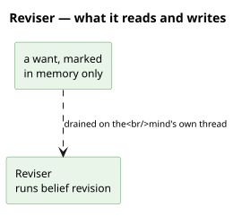

# What it reads and writes

**No repository, no graph, and the absence is the design.** A mark is not a belief — it is the
question of whether a change is worth a pass, and an answer nobody should be able to read back.

# What it is

`packages/orexis-agent-deliberation/reviser.py` — in the deliberation layer, because the thread
it runs is THE DELIBERATION WORKER: one of three threads, one per timescale (the reactive loop
runs handlers and takes, the scheduler keeps time, this one searches), and the only one allowed
to take long. Everything that notices a change — a reading recorded, an offer heard, a
claim presented — leaves a **mark** here and returns. A mark names one
[desire](/domain/desire.md) and says only *this may be worth reconsidering*; it carries no
verdict, because the verdict is [deliberation](/domain/deliberator.md)'s and takes as long as
it takes.

The marks are **drained** on the agent's own clock: a thread of the mind's, started with the
agent, which puts each marked want through [executor](/domain/executor.md). The
[deliberator](/domain/deliberator.md)'s patience tick is one more thing that marks — since
#452 it searches nothing itself, because it lands on the reactive loop. What comes out the other side is what always came out — an
[intention](/domain/intention.md) written, an [act](/domain/act.md) handed to an
[actor](/domain/actor.md) — only not inside the handler that noticed.

**One mark per want, and none for a reading the world was going on as believed** (#632).
Ten readings arriving between two passes leave one mark, not ten — and ten readings inside
the bands the expected next [observation](/domain/observation.md) said they may be in leave
none. [Sensing](/domain/sensing.md) compares a reading with the first
[prediction](/domain/prediction.md) of its key at arrival and hands this seam the two sets of
bands; the seam's rule is one line: sharing a band, absorbed; sharing none, an exogenous
surprise, marked with what contradicted what, which the pass writes as
`deliberation:surprise`; with no prediction standing, marked as any change was. A reading
that crosses a band boundary inside the expected set wakes nothing, which is the hysteresis
the deliberation storm asked for, obtained without a margin. The patience tick still marks
every want on the agent's clock, so a dose the world goes on needing is planned, and one the
world goes on as believed is not re-decided at every reading. What a fuller seam would
decide is whether a change could alter any plan at all, which is
[model-it-only-if-a-plan-would-branch-on-it](/decisions/model-it-only-if-a-plan-would-branch-on-it.md)'s
test applied to a change rather than to a belief.

# Why a mark and not a call

A handler must never block ([layered-by-timescale-and-interruptibility](/decisions/layered-by-timescale-and-interruptibility.md)),
and a search is the slowest thing an agent does. Calling one from a handler blocked every other
message for the length of a pass, and would have stalled the bus outright once a model sat
inside the search.

The consequence a reader should expect: **whoever leaves a mark learns nothing back.** A caller
that needs to know what came of it reads where the answer lands — the ledger, or the act it is
handed — never from the mark. Two callers had to change when this arrived, and both got simpler:
a bidder finds out at the round's close, through the give-up it already kept, and a host lets a
presented [claim](/domain/claim.md) stay held, which is what an unpursued one did anyway.

# In Agent 0.2.0, the seam is the sensing layer

`agent/sensing/` is the belief revision function of the new tree (#783), three functions over
the store and no mark: `revise`, which writes what a reading is; `predict`, which runs every
drift the packages declare over the reading in hand and writes the ladder of predictions,
each starting where the classification probably changes; and `surprise`, which answers a
sentence where the reading contradicts the prediction holding at its instant, or where
nothing was predicted for it, and None where the world went on as believed. The sentence is
what a container wakes the planner on; the layer itself weighs nothing, mints nothing and
knows no executor. The freshness want the 0.1.0 module derived is not here: a reading's
standing as the present is its graph's period, and not knowing is the region desire's
`unmeasured` side, which a look repairs.

# What it is not

**Not the belief write.** [Sensing](/domain/sensing.md) writes the
[observation](/domain/observation.md); this is what happens after, and only about wants.

**Not a queue of work.** A mark is not a task and holds no instruction: two marks for one want
are one mark, and a mark whose want has since been dropped simply finds nothing to pursue.

**The only door to deliberation, since #452.** The patience tick used to search directly,
because it was the mind's own clock on a thread of its own and there was nothing to hand off
to. A timer lands on the reactive loop now, which must never be held for a search, so the tick
marks here like everything else and the worker below is the one place a search runs.
