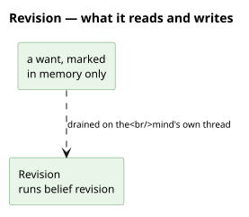

# What it reads and writes

**No repository, no graph, and the absence is the design.** A mark is not a belief — it is the
question of whether a change is worth a pass, and an answer nobody should be able to read back.

# What it is

`agent/revision.py`. Everything that notices a change — a reading recorded, an offer heard, a
claim presented — leaves a **mark** here and returns. A mark names one
[desire](/domain/desire.md) and says only *this may be worth reconsidering*; it carries no
verdict, because the verdict is [deliberation](/domain/deliberator.md)'s and takes as long as
it takes.

The marks are **drained** on the agent's own clock: a thread of the mind's, started with the
agent, which puts each marked want through [executor](/domain/executor.md) exactly as the
patience tick does. What comes out the other side is what always came out — an
[intention](/domain/intention.md) written, an [act](/domain/act.md) handed to an
[actor](/domain/actor.md) — only not inside the handler that noticed.

**One mark per want.** Ten readings arriving between two passes leave one mark, not ten. That
is the whole of the judgement today, and the honest description of it is *deduplication rather
than filtering*: what a fuller seam would decide is whether the change could alter any plan at
all, which is [model-it-only-if-a-plan-would-branch-on-it](/decisions/model-it-only-if-a-plan-would-branch-on-it.md)'s
test applied to a change rather than to a belief.

# Why a mark and not a call

A handler must never block ([layered-by-timescale-and-interruptibility](/decisions/layered-by-timescale-and-interruptibility.md)),
and a search is the slowest thing an agent does. Calling one from a handler blocked every other
message for the length of a pass, and would have stalled the bus outright once a model sat
inside the search.

The consequence a reader should expect: **whoever leaves a mark learns nothing back.** A caller
that needs to know what came of it reads where the answer lands — the ledger, or the act it is
handed — never from the mark. Two callers had to change when this arrived, and both got simpler:
a bidder finds out at the round's close, through the give-up it already kept, and a host lets a
presented [claim](/domain/claim.md) stay held, which is what an unpursued one did anyway.

# What it is not

**Not the belief write.** [Sensing](/domain/sensing.md) writes the
[observation](/domain/observation.md); this is what happens after, and only about wants.

**Not a queue of work.** A mark is not a task and holds no instruction: two marks for one want
are one mark, and a mark whose want has since been dropped simply finds nothing to pursue.

**Not the only door to deliberation.** The keeper's patience tick searches directly, because it
is the mind's own clock rather than something noticing a change — there would be nothing to
hand off to.
