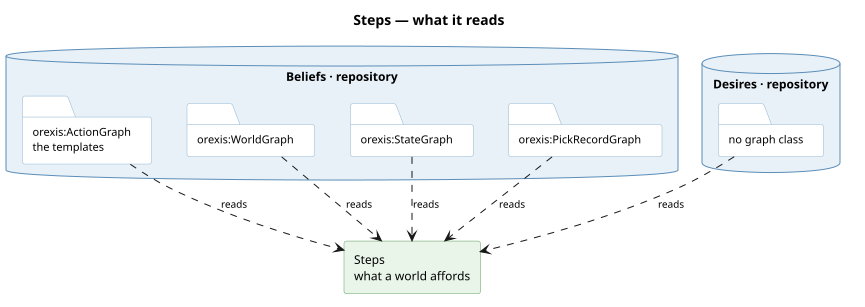

# What it is

`progression:Step`. **An [action](/domain/action.md) picked for execution**, carrying what it was
picked WITH:

| | |
|---|---|
| `action` | the kind of act — `sensing:Observing`, `actuation:Dosing`, `market:Acquiring`, `hanoi:Move` |
| `binding` | the variables: one pair per parameter the action declares it `orexis:takes`. It is also the step's IDENTITY — two steps of one action are the same step when they are filled the same way |
| `want` | the [desire](/domain/desire.md) it serves, by node. Empty on one that serves any want (a host's Offering) |
| `for_agent` | whom it serves, where it is an obligation's. Absent on the agent's own |

and, once a search has planned with it, the quantity, the window, what it predicted, what it
reads, and what it was expanded from.

# What a world admits, and what a plan picks

A world admits one of these per action per legal filling — `hanoi:Move` with this disk onto that
peg, `actuation:Dosing` through this valve. **The search ranges over them and picks; the picked
ones are the plan's steps.** Which is why the shape is one and not two: what a search adds is
absent on one nobody has picked, and that is what `None` in those fields means.

It WAS two classes — an `Affordance` carrying the four columns above and a `Step` carrying those
plus the search's, with a `from_row` copying one into the other the moment anything wanted to
plan with it. Two classes for one shape is how a reader comes to believe there are two concepts,
and the second word was doing no work the absent fields were not already doing. See
[a-row-is-a-step](/decisions/a-row-is-a-step.md).

Nothing has happened yet in any of this, and that is the reason the word is not
[act](/domain/act.md): a plan is not executed, so its elements are not acts. The sovereign's
ruling, 2026-09-02.

# What a world admits is derived, and that is not a performance choice

What a world admits is a **conclusion whose premises are stored** — regions, wiring,
denominations, all facts that exist for their own reasons. Storing the conclusion would let it
outlive them: unplumb the valve and an authored one still says you can dose. So they are computed
on every ask, and the [menu graph](/decisions/the-mind-is-six-graphs.md) holds rules about
actions but never what would fill them.

The same argument in reverse is why the [action](/domain/action.md) *is* stored — a node in
`actions.ttl` is a schema, and a schema cannot outlive anything. And it is why a step a plan
holds IS written: it is not a conclusion about the world any more, it is a commitment, and the
ledger is where a commitment belongs.

# Which world, is the caller's to say

**The world a step is available in is a PARAMETER, and that is the whole of why nothing is
stored.** `Steps` is handed the graphs to ask about — what a rule reads as it holds now, or the
[imaginarium](/domain/imaginarium.md)'s list for a world a plan is imagining — so stock after a
refill appears among that world's steps and not among this one's. A stored answer has one world;
a search needs one per node.

Every token a precondition carries is filled by `store.bind` (#500): a whole token, rendered as
the term the value is, and a text still carrying a token nobody bound refuses rather than
reaching the engine as a free variable — where the engine's own parameters serve only the
kernel's simple queries, since they cannot reach a subquery or an aggregate.

**Neither this nor [actions](/domain/action.md) is the [menu](/domain/menu.md).** The menu is the
MODALITY both sit in — *what I could do* — and the word had been naming all three. `Actions`
keeps what the packages declare; `Steps` derives what one of them comes to in one world, and
`Steps.find_all` loops the first into the second for the templates it is handed. A service stood
between them until it turned out to fetch nothing and decide nothing.

# A step's availability is the precondition language

This is the part worth internalising, because it is why planning needs no `requires` clause of
its own.

**A step whose premises cannot hold does not exist.** Sensing's walk is `polls → monitors →
observes`; the market's closes venue → source → good → valuation. Every hop must hold or there
is no step. So "is this act available?" and "does this step exist?" are the same question — and
**chaining is the same query re-run in the simulated world**: an effect that makes a missing step
appear is the step before it.

`packages/orexis-agent-deliberation/planner.py` therefore consults no declaration of what an
action repairs. Simulation is the authority either way: trying one that turns out not to help
costs one validation; trusting a declaration that turns out to be wrong costs a plant.

# Each package ships its own

There is no menu file. Each package that owns a way of acting ships its
[actions](/domain/action.md), and `Steps.find_all` runs every action's precondition it is
handed — sensing contributes Observe, actuation Actuate, the market Acquire and the host's Apply.

It began as one `menu.rq` in the deliberation package, which made the KINDS of action a registry
in one directory: adding a way of acting meant editing another package's file. The sovereign
caught the overclaim — *how is it dynamic if the list is hardcoded?* — and the fix was this
repo's mechanic applied again. **A new way of acting is a new directory**: an action node for its
schema, availability and effect, and a `take()` on the module the node names.

`$me` is the one thing a shipped query cannot know, and it is substituted by whoever asks.
Everything else is an unqualified pattern, because regions and wiring are public.

# Whom a step serves

A step of the agent's **own** is an option a deliberator ranges over. One that names `for_agent`
is an **obligation's**: it must be exercised on a valid presentation and must never be *proposed*
for a gap of its own. A host holding a claim owes the dose; nothing about that is a decision, and
a deliberator that ranged over it would be choosing whether to keep its word.

That one column is the whole of the distinction — there is no mode term
([an-action-is-one-node](/decisions/an-action-is-one-node.md)). It is also what lets an obligation
find its action: the step that answers is the one the market joined to the want about that debt,
and it carries whom the debt is owed to.

# The step that is not there

A want nothing affords is a real answer and a legible one. Fern holds a desire in air temperature
and can see it, but nothing it owns or can buy moves it: three Observe steps and nothing else.
That is a **want nothing reaches** — legitimate, not a misconfiguration — and the search reports
it as `no candidate` rather than as failure. It is the difference between *equip me* and *my
doses are too coarse*, which is a distinction a planner that reported them alike would destroy.

# Where a planned one appears

- a plan is a sequence of them. What each would BUY — the urgency the want would have in the
  world it reaches — is not the step's: it is a fact about (world, want), and the weighing
  [deliberation](/domain/deliberator.md) describes is where it lives (#748)
- an [intention](/domain/intention.md) commits to them — `progression:step` to each,
  `progression:by` to the one it stands at, `progression:then` between them in order
- a [claim](/domain/claim.md) promises one: the host's Serving step, so many litres, not after
  the window closes
- the step is what WAITS: its readiness (`progression:until`, `progression:untilNot`), its
  completion (`progression:answeredWhen`), and what the keeper does if a wait lapses
  (`progression:whenLapsed`)
- it carries what it PREDICTED (`progression:predicts`): the facts the search said taking it
  makes true and false, in the plan's own canonical form — a reading as the
  [band](/domain/band.md) its rule declared (#579) — which is what the world is held to once it
  is taken, and why no actor sizes an expectation of its own
- since #550 it carries its **precondition** — the facts its rules read in the world it was
  planned from — beside the prediction, in the same canonical form and on the same ledger row.
  The term was `progression:premises` until #580, when the concept and its term were given one
  name; see [precondition](/domain/precondition.md)
- its QUANTITY is filled when it is TAKEN, not when it is planned (#579): the search sizes
  nothing, and the actuator or the bidder computes how much from the reading in hand
- in Agent 0.2.0 it LANDS as long after it is TAKEN as the plan placed its landing after its
  opening (`execution:landsAt` less `execution:notBefore`): a plan places its steps at the
  instants of the worlds it searched, and a presentation taken a minute late behind a round that
  cleared late was held to its placed instant and failed before the probe could answer it
- in Agent 0.2.0 each [intention](/domain/intention.md)'s steps are its own: a second plan for one
  want names its steps as the first did, so a name an earlier intention holds is tagged, or the
  act the first recorded reads as the second's step already taken
- where it was expanded from a [method](/domain/method.md), the filling it is part of
  (`progression:partOf`)
- once answered, the number it predicted and the number the world showed
  (`progression:predictedValue`, `progression:observedValue`) — the residual
  [review](/domain/review.md) reads, met or unmet alike

# What it is not

**Not an act.** An [act](/domain/act.md) is the record that a step was taken. One step, possibly
several acts, since an actor may be unable to take it now and a later tick takes it.

**Not a place of its own beside the thing placed.** Every planned step is minted for the place it
fills, so its place in the plan is the links from the intention and to the next step, not a node.

# Related

- [action](/domain/action.md) is the node a step is one filling of — its availability query, run now.
- [deliberation](/domain/deliberator.md) ranges over the agent's own, scores them by simulation,
  and holds what an action DOES — an available step says only that it is available.
- [desire](/domain/desire.md) is the other half of a decision: a step answers *what could I do*, a
  gap answers *about what*.
- [actor](/domain/actor.md) is the code a step is linked to: the module that contributes its action.
- [package](/domain/package.md) is how a contribution is found: a directory, and nothing lists it.
- [the-mind-is-six-graphs](/decisions/the-mind-is-six-graphs.md) places what a world admits in
  the menu modality and explains why it is derived where a rule is asserted.
