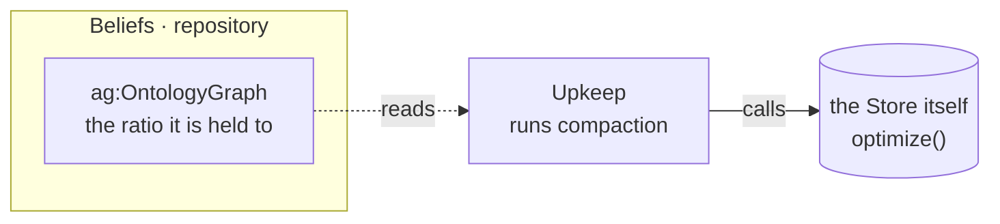

# What it runs

**Compaction.** An agent's store grows on disk for ever while its triple count never moves: the
sensed graph upserts one observation per subject and property, so every reading appends a version
plus a tombstone, and a few hundred triples never reach a size-triggered threshold.

# What it reads and writes

**No named graph, and that is the finding.** Every other service writes a graph, because what it
concludes is a fact somebody authored. Upkeep changes bytes on disk and asserts nothing, so it
reaches past the repository to the store — the one place in the mind where that is right.

# Why it is not a capability

Every agent has a belief base whatever else it can do, so a rule granting a *please maintain
yourself* ability would fire for everybody. What is a capability is reconsidering something an
agent CHOSE: reviewing can be done by rule or by asking a model, and compacting cannot be done
two ways.
